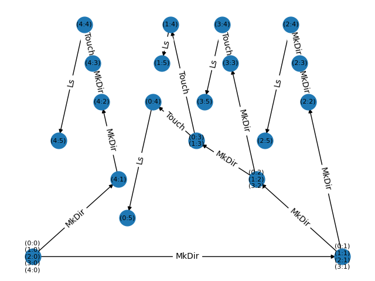

# Chai Example Application

This directory contains a demo showing how the `apalache-chai` client libray can be
used to interact with the Apalache server.

The demo is defined in [./app.py](./app.py). It performs the following actions:

- Connects to a running Apalache server
- Makes an RPC call to the server to parse a TLA+ file into a JSON representation
  of the model
- Updates the model to add some values taken from CLI args
- Makes an RPC call to the server to obtain counter-examples from the
  model-checker
- Produce a (crappy) graph showing the state transitions in the counter-examples

The spec used to generate counterexamples is defined in
[./FileSystem.tla](./FileSystem.tla). It specifies a simple filesystem
supporting three actions:

- Creating flat files (like `touch`)
- Creating directories (like `mkdir`)
- Listing the children of a directory  (like `ls`)

The spec is used to generate counter-examples leading up to certain states. The
python app takes CLI parameters that determine the properties of the states, and
does plumbing to interact with the Apalache server.

Here's an example of a session:

```sh
$  poetry run python example/app.py --help
usage: app.py [-h] [--names NAMES] [--path-length PATH_LENGTH] [--dir-size DIR_SIZE] [--branches BRANCHES]

optional arguments:
  -h, --help            show this help message and exit
  --names NAMES         which names can be used for forming file paths
  --path-length PATH_LENGTH
                        the system must include a path with at least this many components
  --dir-size DIR_SIZE   A directory with at least this many children must exist
  --branches BRANCHES   the max paths to a suitable state that should be found

# Start the apalache server in the background
$ apalache-mc server > /dev/null &

# Run the program, and generate the state graph
$  poetry run python example/app.py --names foo,bar,baz,qux --path-length 4 --branches 5
Connection to the Apalache server established
Source file loaded from /home/sf/Sync/informal-systems/apalache/apalache-chai/example/FileSystem.tla
Model parsed, typechecked, and loaded
Model parameters updated from CLI params
Counter examples have been obtained
The state graph has been saved to demo-states-graph.png

# Foreground apalache and kill it
$  fg
apalache-mc server > /dev/null
^C
```

The resulting graph will look something like this:



The labels on the edges show the command that transitions between each state.
The label on the nodes show the indexes of that state in the form
`(trace_n,state_n)` where `trace_n` is the number of the counter-example trace
in which the state was procued and `state_n` is the index of state in that
trace. These can be cross referenced against the counter example data.
